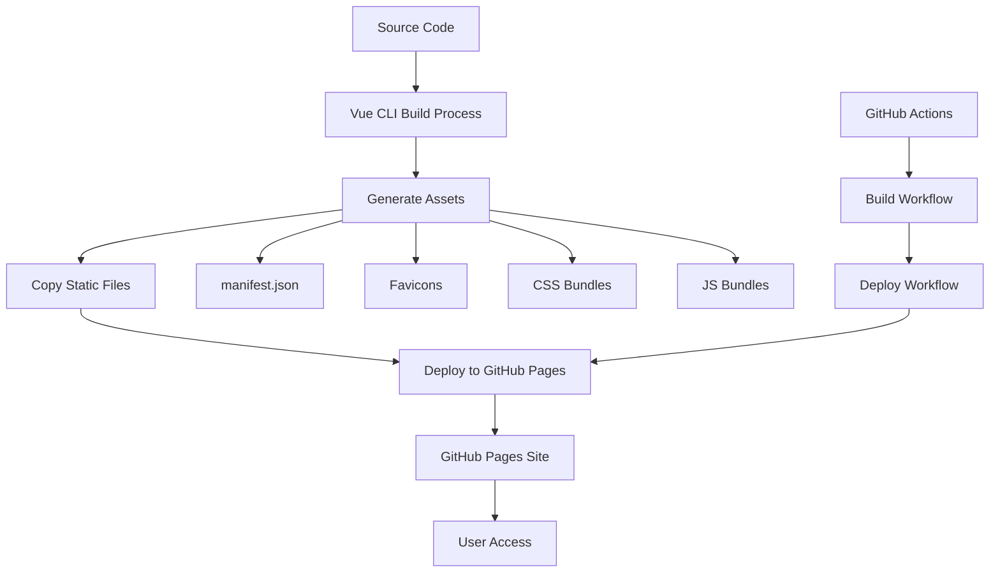

# Design Document

## Overview

The GitHub Pages deployment is failing due to incorrect asset paths and missing build artifacts. The current configuration has the correct `publicPath` set to `/TestResults/`, but the build process is not generating all required assets or they're not being deployed correctly. This design addresses the deployment pipeline, build configuration, and asset management to ensure a successful GitHub Pages deployment.

## Architecture

### Current Issues Analysis

1. **Missing Manifest**: The PWA manifest.json is not being generated or deployed
2. **Missing Favicons**: Favicon files are not being copied to the build output
3. **Missing CSS Bundles**: Webpack chunks are not being found at expected paths
4. **Deployment Pipeline**: GitHub Actions workflow focuses on report indexing but doesn't handle app deployment

### Proposed Solution Architecture



## Components and Interfaces

### 1. Build Configuration Enhancement

**Vue CLI Configuration (`vue.config.js`)**
- Ensure proper asset generation and copying
- Configure PWA plugin correctly
- Set up proper chunk naming for consistent asset paths

**Key Changes:**
- Add explicit favicon configuration
- Ensure manifest.json generation
- Configure proper asset output paths
- Add build validation steps

### 2. GitHub Actions Deployment Workflow

**New Workflow: `deploy-app.yml`**
- Separate workflow for application deployment
- Build the Vue application
- Deploy to GitHub Pages
- Handle both app deployment and report indexing

**Workflow Structure:**
```yaml
name: Deploy Application
on:
  push:
    branches: [main]
    paths-ignore: ['cucumber-report-viewer/public/TestResultsJsons/*.json']
  workflow_dispatch:

jobs:
  build-and-deploy:
    runs-on: ubuntu-latest
    steps:
      - Checkout code
      - Setup Node.js
      - Install dependencies
      - Build application
      - Deploy to GitHub Pages
```

### 3. Asset Management System

**Static Assets Structure:**
```
public/
├── favicon.ico
├── img/
│   └── icons/
│       ├── favicon-16x16.png
│       ├── favicon-32x32.png
│       └── apple-touch-icon.png
├── manifest.json
└── TestResultsJsons/
    └── [report files]
```

**Build Output Structure:**
```
dist/
├── index.html
├── manifest.json
├── img/
│   └── icons/
├── css/
│   ├── app.[hash].css
│   └── vendors.[hash].css
├── js/
│   ├── app.[hash].js
│   └── vendors.[hash].js
└── TestResultsJsons/
```

### 4. PWA Configuration

**Manifest.json Configuration:**
```json
{
  "name": "Cucumber Report Viewer",
  "short_name": "Cucumber Reports",
  "description": "View and analyze Cucumber test reports",
  "theme_color": "#3B82F6",
  "background_color": "#ffffff",
  "display": "standalone",
  "start_url": "/TestResults/",
  "scope": "/TestResults/",
  "icons": [
    {
      "src": "/TestResults/img/icons/favicon-16x16.png",
      "sizes": "16x16",
      "type": "image/png"
    },
    {
      "src": "/TestResults/img/icons/favicon-32x32.png",
      "sizes": "32x32",
      "type": "image/png"
    }
  ]
}
```

## Data Models

### Build Configuration Model

```javascript
// vue.config.js structure
{
  publicPath: '/TestResults/',
  outputDir: 'dist',
  assetsDir: 'static',
  pwa: {
    name: 'Cucumber Report Viewer',
    themeColor: '#3B82F6',
    manifestOptions: {
      start_url: '/TestResults/',
      scope: '/TestResults/'
    }
  },
  configureWebpack: {
    // Asset optimization
  },
  chainWebpack: {
    // Asset copying and processing
  }
}
```

### Deployment Status Model

```javascript
// Deployment tracking
{
  buildStatus: 'success' | 'failed' | 'in-progress',
  deploymentUrl: 'https://srisritp2.github.io/TestResults/',
  assetsGenerated: {
    manifest: boolean,
    favicons: boolean,
    cssChunks: boolean,
    jsChunks: boolean
  },
  lastDeployment: timestamp,
  errors: string[]
}
```

## Error Handling

### Build Error Handling

1. **Asset Generation Failures**
   - Validate all required assets are generated
   - Fail build if critical assets are missing
   - Provide clear error messages for missing dependencies

2. **Deployment Failures**
   - Retry mechanism for transient failures
   - Rollback to previous version on critical failures
   - Notification system for deployment status

3. **Runtime Error Handling**
   - Graceful degradation when assets fail to load
   - Fallback mechanisms for PWA features
   - User-friendly error messages

### Error Recovery Strategies

```javascript
// Asset loading fallback
const loadAssetWithFallback = (primaryUrl, fallbackUrl) => {
  return fetch(primaryUrl)
    .catch(() => fetch(fallbackUrl))
    .catch(() => {
      console.warn('Asset failed to load:', primaryUrl);
      // Provide default behavior
    });
};
```

## Testing Strategy

### Build Testing

1. **Asset Generation Tests**
   - Verify all required files are generated
   - Check file sizes and formats
   - Validate manifest.json structure

2. **Deployment Tests**
   - Test deployment to staging environment
   - Verify all assets are accessible
   - Check PWA functionality

3. **Integration Tests**
   - End-to-end deployment pipeline testing
   - Cross-browser compatibility testing
   - Performance testing on deployed site

### Validation Scripts

```bash
#!/bin/bash
# validate-build.sh
echo "Validating build output..."

# Check required files exist
required_files=(
  "dist/index.html"
  "dist/manifest.json"
  "dist/img/icons/favicon-16x16.png"
  "dist/img/icons/favicon-32x32.png"
)

for file in "${required_files[@]}"; do
  if [ ! -f "$file" ]; then
    echo "❌ Missing required file: $file"
    exit 1
  fi
done

# Validate manifest.json
if ! jq empty dist/manifest.json; then
  echo "❌ Invalid manifest.json"
  exit 1
fi

echo "✅ Build validation passed"
```

## Implementation Plan

### Phase 1: Fix Build Configuration
1. Update `vue.config.js` with proper PWA configuration
2. Add missing favicon files to public directory
3. Configure proper asset copying and generation
4. Add build validation scripts

### Phase 2: Create Deployment Workflow
1. Create new GitHub Actions workflow for app deployment
2. Separate app deployment from report indexing
3. Add proper build and deployment steps
4. Configure GitHub Pages deployment

### Phase 3: Asset Management
1. Ensure all static assets are properly configured
2. Add proper manifest.json generation
3. Configure favicon and icon handling
4. Test PWA functionality

### Phase 4: Testing and Validation
1. Add build validation steps
2. Test deployment pipeline
3. Verify all assets load correctly
4. Test PWA installation and offline functionality

## Security Considerations

### Asset Integrity
- Use subresource integrity (SRI) for external assets
- Validate asset checksums during build
- Secure asset delivery over HTTPS

### Deployment Security
- Use minimal permissions for GitHub Actions
- Validate build artifacts before deployment
- Implement proper secret management

## Performance Optimization

### Asset Optimization
- Enable gzip compression for all assets
- Implement proper caching headers
- Optimize image assets (favicons, icons)
- Use efficient chunk splitting

### Deployment Optimization
- Implement incremental deployments
- Use CDN for static assets where possible
- Optimize build times with caching
- Implement parallel deployment steps

## Monitoring and Maintenance

### Deployment Monitoring
- Track deployment success/failure rates
- Monitor asset loading performance
- Set up alerts for deployment failures
- Track PWA installation metrics

### Health Checks
- Automated checks for asset availability
- Performance monitoring for deployed site
- Regular validation of PWA functionality
- Monitoring of GitHub Pages service status